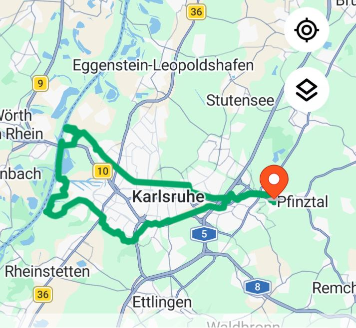
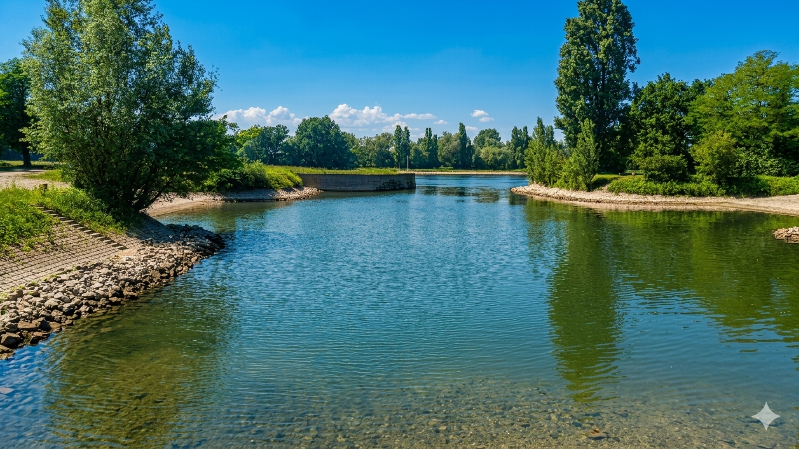
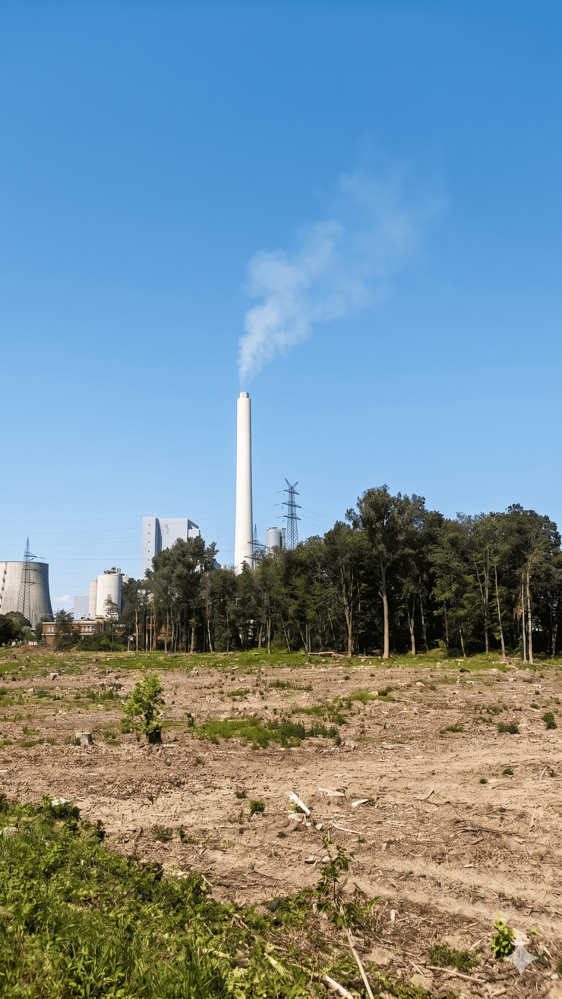
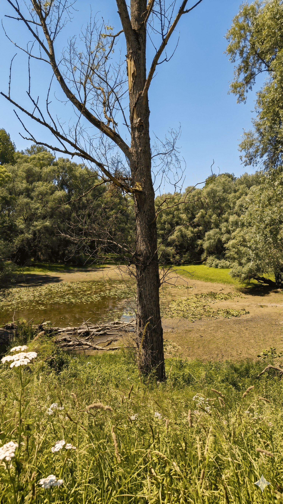
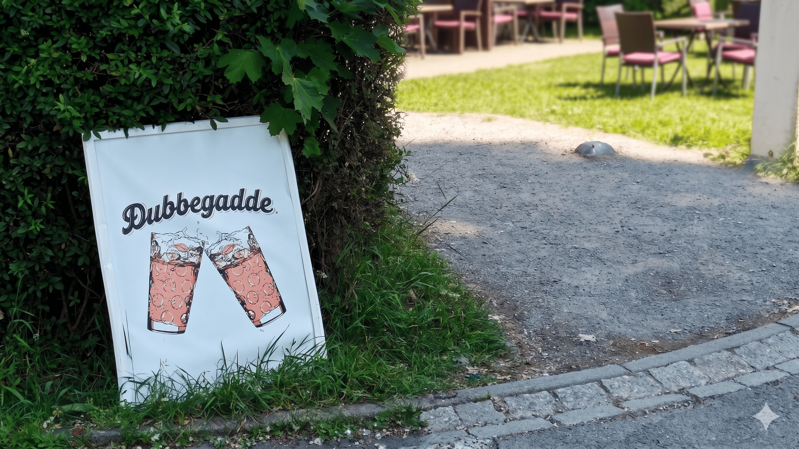
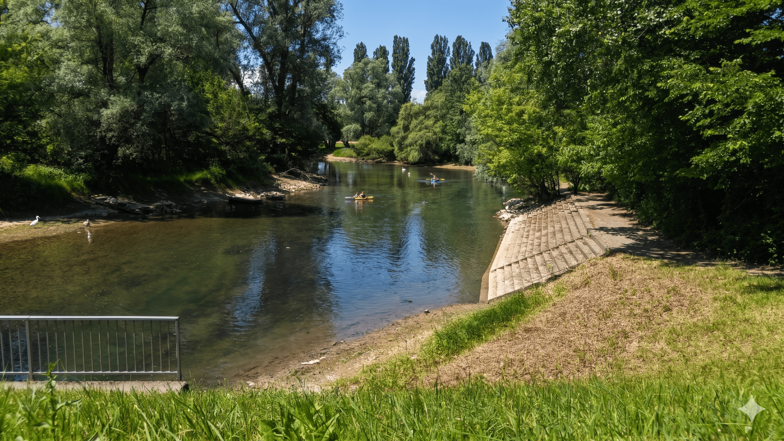
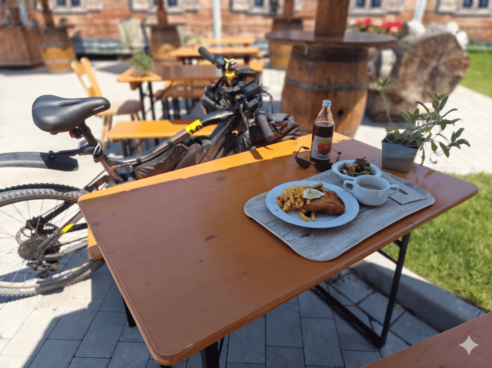
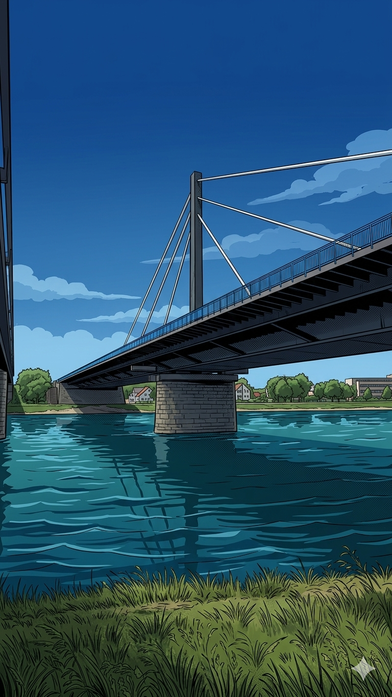
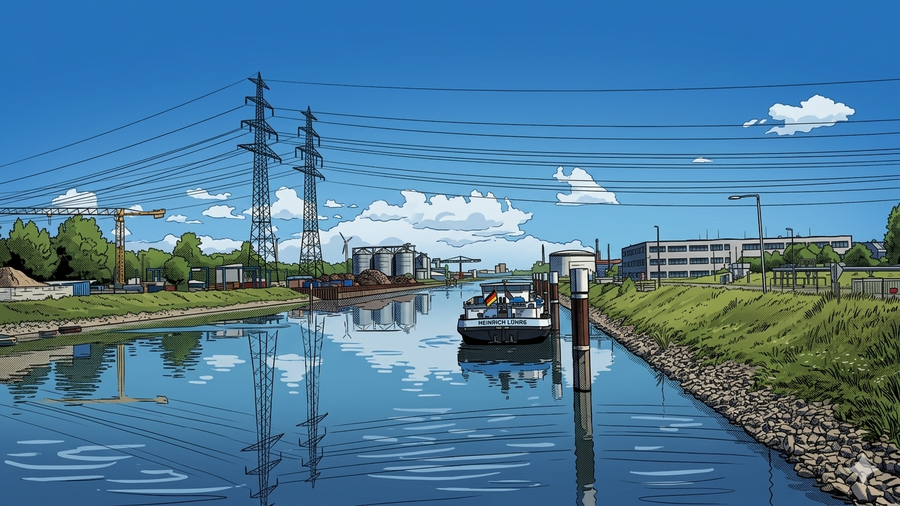
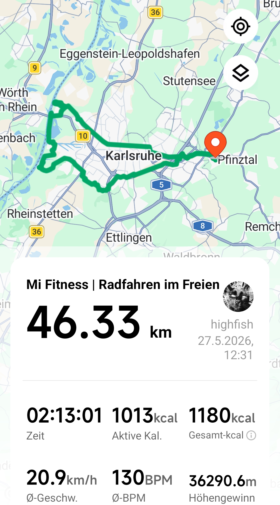

# hAITour: Pfinztal → Rheinhafen 🚴‍♂️🌊

<p align="center">
  
</p>

<p align="center">
  
  <br/>
  <em>🗺️ Tour-Karte: Pfinztal → Rheinhafen (MiRo, 27.05.2026)</em>
</p>

<p align="center">
  <a href="https://www.buymeacoffee.com/highfish">
    
  </a>
</p>

  

> **Hybrid AI Tour** – Eine Fahrradtour vom **Pfinztal** bis zum **Rheinhafen**, dokumentiert mit Karten, Bildern und GitHub Pages. 🤖🚴

---

## 🗺️ Route – Google Maps

<p align="center">
  <a href="https://maps.app.goo.gl/7Ax5h4YXwzTJUCAS7" target="_blank">
    
  </a>
</p>

> 📍 [Komplette Route: Pfinztal → Rheinhafen auf Google Maps öffnen](https://maps.app.goo.gl/7Ax5h4YXwzTJUCAS7)

---

## ⌚ Tour-Daten (GPX · Mi Fitness)

| Wert | Daten |
|---|---|
| 📅 Datum | 27.05.2026 |
| 📏 Distanz | **46,3 km** |
| 🏔️ Anstieg kumuliert | ~362 m (lt. Mi Fitness) |
| 📍 Start | Durlach / Pfinztal (lat 49.003, lon 8.500) |
| ⌚ Aufzeichnung | Mi Fitness (Xiaomi Smartwatch) |
| 🕐 Startzeit | 12:31 UTC (14:31 MESZ) |
| 📁 GPX-Datei | [`hAITour_Pfinztal_Rheinhafen_MiRo_20260527.gpx`](docs/hAITour_Pfinztal_Rheinhafen_MiRo_20260527.gpx) |

---

## 🎬 Tour-Highlight – Jetzt ansehen!

<p align="center">
  <a href="https://youtube.com/shorts/r1ia93qhVPs" target="_blank">
    
  </a>
</p>

> 🎥 [hAITour Pfinztal → Rheinhafen – YouTube Short](https://youtube.com/shorts/r1ia93qhVPs)

---

## 🌍 Überblick

Dieses Repository begleitet meine Fahrradtour vom **Pfinztal** bis zum **Rheinhafen**.

1. **Teil 1 – Start im Pfinztal** → [Google Maps](https://maps.app.goo.gl/7Ax5h4YXwzTJUCAS7)

---

## 📥 GPX-Tracks herunterladen

| Abschnitt | Google Maps | GPX Download |
|---|---|---|
| 🚴 **Gesamttrack** – Pfinztal → Rheinhafen | [Maps 🗺️](https://maps.app.goo.gl/7Ax5h4YXwzTJUCAS7) | [⬇️ GPX herunterladen](docs/hAITour_Pfinztal_Rheinhafen_MiRo_20260527.gpx) |

> 💡 **Hinweis:** Die GPX-Tracks liegen im Ordner `docs/` und können direkt heruntergeladen werden.

---

## 🖼️ Fotogalerie der Tour

> 📸 Impressionen von der Fahrradtour Pfinztal → Rheinhafen, 27.05.2026

<p align="center">
  
  
</p>
<p align="center">
  
  
</p>
<p align="center">
  
  
  
</p>
<p align="center">
  
  
  
</p>
<p align="center">
  
  
</p>
<p align="center">
  
</p>

---

## 🗺️ Karten & Abschnitte

### Teil 1: Pfinztal – Start
- Start: Pfinztal / Durlach
- Charakter: Einrollen, Flussnähe, viel Grün 🌳
- Route: [Gesamtroute auf Google Maps](https://maps.app.goo.gl/7Ax5h4YXwzTJUCAS7)

---

## ⌚ Fitnessdaten der Tour – Smartwatch-Aufzeichnung

<p align="center">
  
</p>

> 📱 Screenshot aus der **Mi Fitness App** – Aufzeichnung der Fahrradtour vom 27.05.2026

---

## 🧱 Projektstruktur

```text
hAITour.Pfinztal.bis.Rheinhafen.MiRo/
├─ README.md
├─ index.html
├─ LICENSE
├─ logo_PfinztalRheinhafen.png
├─ screenshot.Tour.jpg
├─ images/
│   ├─ 01_.png
│   ├─ 02_.png
│   ├─ 03_.png
│   ├─ 04_.png
│   ├─ Gemini_Generated_Image_.png
│   ├─ Gemini_Generated_Image_560hmo560hmo560h.png
│   ├─ Gemini_Generated_Image_exf85rexf85rexf8.png
│   ├─ Gemini_Generated_Image_gdvy47gdvy47gdvy.png
│   ├─ Gemini_Generated_Image_qp07ixqp07ixqp07.png
│   ├─ Gemini_Generated_Image_rj8zgarj8zgarj8z.png
│   ├─ other/
│   │   ├─ 1779960414223.png
│   │   ├─ 1779960511758.png
│   │   ├─ collage.png
│   │   └─ tourMap.jpg
│   ├─ teil1/
│   ├─ teil2/
│   └─ teil3/
├─ tracks/
│   └─ hAITour_Pfinztal_Rheinhafen_MiRo_20260527.gpx
└─ docs/
    └─ hAITour_Pfinztal_Rheinhafen_MiRo_20260527.gpx
```

---

## 📄 Lizenz

Dieses Projekt steht unter der **MIT-Lizenz**. Details siehe [`LICENSE`](LICENSE).
